# Laporan Modul 2: Dasar Pemrograman Java
**Mata Kuliah:** Praktikum Pemrograman Berorientasi Objek   
**Nama:** SYAKILA ATHAYA AUFA  
**NIM:** 2024573010053  
**Kelas:** TI 2E  
**Tanggal Praktikum:** 18 September 2025

---

## 1. Abstrak
Laporan ini dibuat untuk mendokumentasikan hasil praktikum Dasar Pemrograman Java pada materi variabel, input-output, percabangan, dan perulangan. Praktikum bertujuan agar mahasiswa memahami konsep dasar pemrograman Java melalui implementasi langsung dalam kode program. Setiap langkah praktikum dicatat beserta hasil output sebagai bukti keberhasilan. Dengan adanya laporan ini, pembelajaran menjadi lebih terstruktur dan memudahkan dalam memahami dasar pemrograman yang akan digunakan pada mata kuliah lanjutan.

---
## 2. Praktikum
### Praktikum 1 — Variabel dan Tipe Data
#### Dasar Teori
Variabel adalah wadah untuk menyimpan data dengan tipe tertentu. Java memiliki dua kategori utama :
* tipe data primitif (
int ,
double ,
* tipe referensi seperti
char ,
boolean ) dan
String atau array. Tipe data menentukan besar memori dan operasi yang bisa dilakukan 
---
Tipe Data Primitif
* byte: 8-bit signed integer (-128 to 127)
* short: 16-bit signed integer (-32,768 to 32,767)
* int: 32-bit signed integer (-2,147,483,648 to 2,147,483,647)
* long: 64-bit signed integer
* float: 32-bit IEEE 754 floating point
* double: 64-bit IEEE 754 floating point
* boolean: true atau false
* char: 16-bit Unicode characte
---
Tipe Data Reference
* String, Array, Object, dll.
---
Aturan Penamaan Variabel
* Dimulai dengan huruf, underscore (_), atau dollar sign ($)
* Tidak boleh dimulai dengan angka
* Case sensitive
* Tidak boleh menggunakan keyword Java
---
Prasyarat
* Buat sebuah package baru dengan nama modul_2 di dalam folder src
---
#### Langkah Praktikum
Langkah 1: Variabel dan tipe data

1. Buat file baru dengan nama VariabelDemo.java
2. Ketik kode berikut:
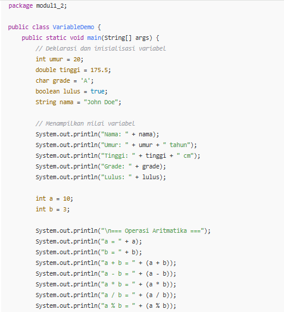
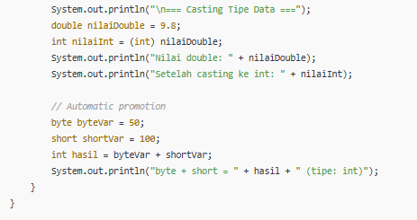

#### Screenshoot Hasil
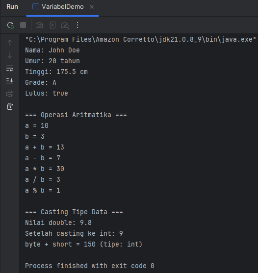

---
#### Analisa dan Pembahasan
1. Deklarasi dan Inisialisasi Variabel
   * int umur = 20;
   * double tinggi = 175.5;
   * char grade = 'A';
   * boolean lulus = true;
   * String nama = "John Doe";

* int → bilangan bulat: umur = 20.
* double → bilangan pecahan/desimal: tinggi = 175.5.
* char → satu karakter: grade = 'A'.
* boolean → nilai logika: lulus = true.
* String → kumpulan karakter/teks: nama = "John Doe".  
➡Bagian ini menunjukkan bagaimana Java mendukung berbagai tipe data.
---
2. Menampilkan Nilai Variabel
   * System.out.println("Nama: " + nama);
   * System.out.println("Umur: " + umur + " tahun");
   * System.out.println("Tinggi: " + tinggi + " cm");
   * System.out.println("Grade: " + grade);
   * System.out.println("Lulus: " + lulus);  

Output yang ditampilkan:  
- Nama: John Doe
- Umur: 20 tahun
- Tinggi: 175.5 cm
- Grade: A
- Lulus: true  
➡Di sini digunakan string concatenation (+) untuk menggabungkan teks dan variabel agar bisa ditampilkan.
---
3. Operasi Aritmatika
   * int a = 10;
   * int b = 3;
   * System.out.println("a + b = " + (a + b));
   * System.out.println("a - b = " + (a - b));
   * System.out.println("a * b = " + (a * b));
   * System.out.println("a / b = " + (a / b));
   * System.out.println("a % b = " + (a % b));

(+) → penjumlahan → 10 + 3 = 13  
(-) → pengurangan → 10 - 3 = 7  
(*) → perkalian → 10 * 3 = 30  
(/) → pembagian bulat → 10 / 3 = 3 (karena int, bukan pecahan)  
(%) → sisa hasil bagi → 10 % 3 = 1  
➡Menunjukkan operator aritmatika di Java.
---
4. Casting Tipe Data
   * double nilaiDouble = 9.8;
   * int nilaiInt = (int) nilaiDouble;
   * System.out.println("Nilai double: " + nilaiDouble);
   * System.out.println("Setelah casting ke int: " + nilaiInt);

nilaiDouble = 9.8 (tipe double).  
(int) nilaiDouble → konversi paksa (casting) → hasil 9 (bagian desimal dibuang).
➡Menunjukkan type casting manual (explicit casting).
---
5. Automatic Promotion (Promosi Otomatis Tipe Data)
   * byte byteVar = 50;
   * short shortVar = 100;
   * int hasil = byteVar + shortVar;
   * System.out.println("byte + short = " + hasil + " (tipe: int)");

Operasi aritmatika di Java dengan tipe lebih kecil (byte, short) otomatis dipromosikan ke int.  
Jadi hasilnya 50 + 100 = 150 dengan tipe data int.  
➡Ini contoh automatic type promotion di Java.

---
- Kesimpulan  
Program VariableDemo memperlihatkan dasar-dasar pemrograman Java, meliputi:  
Deklarasi dan penggunaan variabel dengan berbagai tipe data (primitif & non-primitif).  
Menampilkan output dengan System.out.println().
Operasi aritmatika dasar (+, -, *, /, %).  
Type casting dari double ke int.  
Automatic promotion ketika operasi melibatkan tipe data berbeda.  
Program ini cocok sebagai contoh pengenalan variabel, operator, dan casting di Java.
---

### Praktikum 2 - Input/Output dan Scanner
#### Dasar Teori
Untuk membaca input dari pengguna dalam Java, kita menggunakan class Scanner yang terdapat dalam
package java.util. Scanner menyediakan berbagai method untuk membaca berbagai tipe data:
* nextInt(): membaca integer
* nextDouble(): membaca double
* nextLine(): membaca String (termasuk spasi)
* next(): membaca String (sampai spasi pertama)
* nextBoolean(): membaca boolean

---

#### Langkah Praktikum
Langkah Praktikum Import dan Membuat Scanner
Langkah 1: Import dan Membuat Scanner

1. Buat file baru dengan nama InputOutputDemo.java
2. Ketik kode berikut:
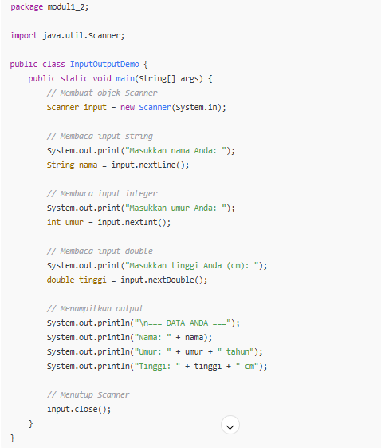

---

#### Screenshoot Hasil
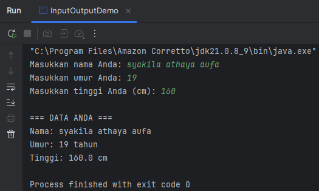  

---

#### Analisa dan Pembahasan
1. Import Library Scanner
2. import java.util.Scanner;

Scanner adalah kelas dari package java.util yang digunakan untuk membaca input dari berbagai sumber, salah satunya keyboard (System.in).   

Wajib di-import supaya bisa digunakan.

---
2. Membuat Objek Scanner
   Scanner input = new Scanner(System.in);  
Membuat objek bernama input dari kelas Scanner.  
System.in artinya input akan dibaca dari keyboard.

➡Ini adalah langkah awal agar program bisa menerima data dari user.

---
3. Membaca Input String
   System.out.print("Masukkan nama Anda: ");
   String nama = input.nextLine();

System.out.print → menampilkan teks ke layar tanpa ganti baris.  
input.nextLine() → membaca satu baris teks yang diketik user.  
Disimpan dalam variabel String nama.

Contoh input:

Masukkan nama Anda: Syakila Athaya Aufa   
Maka variabel nama = "Syakila Athaya Aufa".
---
4. Membaca Input Integer
   System.out.print("Masukkan umur Anda: ");
   int umur = input.nextInt();

input.nextInt() → membaca input berupa bilangan bulat.  
Disimpan ke variabel int umur.

Contoh input:

Masukkan umur Anda: 19  
Maka variabel umur = 19.
---
5. Membaca Input Double
   System.out.print("Masukkan tinggi Anda (cm): ");
   double tinggi = input.nextDouble();

input.nextDouble() → membaca input berupa bilangan desimal.  
Disimpan ke variabel double tinggi.

Contoh input:

Masukkan tinggi Anda (cm): 160  
Maka variabel tinggi = 160.
---
6. Menampilkan Output
   System.out.println("\n=== DATA ANDA ===");
   System.out.println("Nama: " + nama);
   System.out.println("Umur: " + umur + " tahun");
   System.out.println("Tinggi: " + tinggi + " cm");

Hasil input user ditampilkan kembali dengan format rapi.  
\n → untuk membuat baris baru (newline).

Contoh output:

=== DATA ANDA ===  
Nama: Syakila Athaya Aufa  
Umur: 19 tahun  
Tinggi: 160 cm
---
7. Menutup Scanner
   input.close();

Scanner ditutup untuk menghindari kebocoran resource.  
Best practice di Java ketika selesai menggunakan input.

* Kesimpulan

-Program InputOutputDemo berfungsi untuk:  
-Membaca input dari user melalui keyboard (teks, angka bulat, dan angka desimal).  
-Menyimpan input tersebut dalam variabel sesuai tipe datanya (String, int, double).  
-Menampilkan data kembali sebagai output di layar.

➡Program ini adalah contoh dasar Input & Output (I/O) di Java menggunakan Scanner.

---
### Praktikum 3 - Struktur control: Percabangan
#### Dasar Teori

Struktur kontrol percabangan dalam Java adalah mekanisme untuk mengatur alur eksekusi program berdasarkan suatu kondisi. Dengan percabangan, program bisa mengambil keputusan dan menjalankan perintah yang berbeda sesuai input atau keadaan tertentu.

Jenis Percabangan di Java

1. If Statement  
* Bentuk paling sederhana dari percabangan.  
* Mengeksekusi blok kode hanya jika kondisi bernilai true.
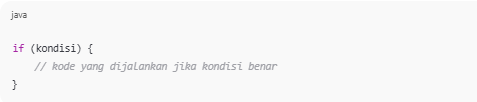

2. If-Else Statement
* Digunakan jika ada dua pilihan: kondisi benar atau salah.
* Misalnya untuk mengecek lulus atau tidak.
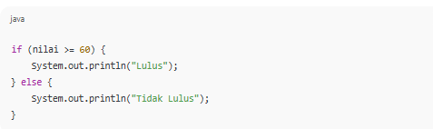

3. If-Else If-Else Statement
* Digunakan untuk lebih dari dua kondisi.
* Misalnya menentukan grade A, B, C, D, atau E.
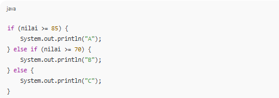

4. Switch Statement
* Alternatif dari if-else untuk kondisi yang berbentuk pilihan diskrit (misalnya angka atau string tertentu).
* Lebih rapi jika terdapat banyak pilihan.
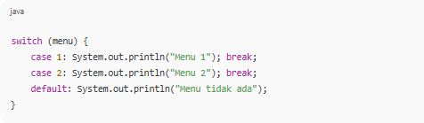

Intinya:
* if digunakan untuk kondisi sederhana.
* if-else if-else digunakan untuk multi kondisi.
* switch digunakan untuk pilihan yang jelas (discrete).
---

#### Langkah Praktikum
Langkah 1: Program Penentu Grade (GradeDemo.java)
1. Buat file baru dengan nama GradeDemo.java
2. Ketik kode berikut:
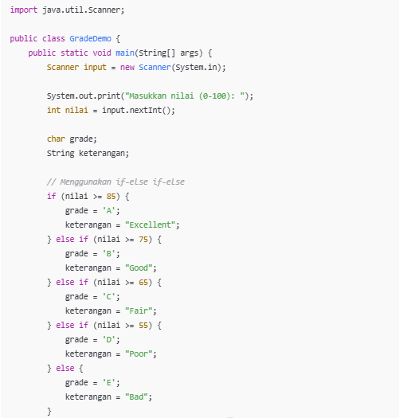
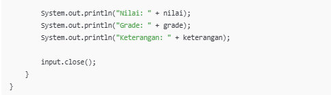

---

#### Screenshoot Hasil
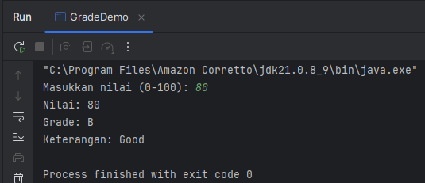

--- 

#### Analisa dan Pembahasan 
Program GradeDemo merupakan implementasi dari penggunaan struktur kendali if-else if-else pada bahasa pemrograman Java. Program ini menerima masukan berupa nilai (0–100) dari pengguna, kemudian mengelompokkan nilai tersebut ke dalam grade (A–E) sesuai dengan kriteria yang telah ditentukan. Selain menampilkan grade, program juga memberikan keterangan berupa deskripsi tingkat pencapaian (Excellent, Good, Fair, Poor, Bad).

Struktur program terdiri dari beberapa bagian utama:
* Deklarasi Package dan Import Scanner
* package modul1_2; → menunjukkan lokasi class di dalam project.
* import java.util.Scanner; → digunakan agar program bisa membaca input dari keyboard.
* Deklarasi Kelas dan Method Main
* public class GradeDemo { ... } adalah kelas utama.
* public static void main(String[] args) merupakan titik awal eksekusi program.

---
Input Data

Program meminta pengguna memasukkan nilai dengan System.out.print lalu membaca input dengan Scanner input = new Scanner(System.in);.

Logika If-Else If-Else  
-Program membandingkan nilai input dengan kondisi tertentu:
* Nilai ≥ 85 → Grade A, "Excellent"
* Nilai ≥ 75 → Grade B, "Good"
* Nilai ≥ 65 → Grade C, "Fair"
* Nilai ≥ 55 → Grade D, "Poor"
* Nilai < 55 → Grade E, "Bad"

Output Data  
Program menampilkan kembali nilai yang diinput, grade yang diperoleh, dan keterangan penilaian.
---
Pembahasan Program  
Dari hasil pengujian, program berjalan sesuai dengan logika yang telah ditentukan. Setiap input yang dimasukkan akan menghasilkan grade dan keterangan yang sesuai.
--- 

Kesimpulan Analisi  
Berdasarkan hasil analisis dan pengujian, dapat disimpulkan bahwa:

Program GradeDemo berhasil membaca input nilai dari pengguna menggunakan kelas Scanner.

Struktur kendali if-else if-else dapat digunakan untuk mengelompokkan nilai ke dalam beberapa kategori grade (A–E) dengan keterangan yang sesuai.

Program berjalan dengan baik dan menghasilkan output yang benar sesuai dengan kriteria yang ditentukan.

Program ini membuktikan bahwa penggunaan percabangan dalam Java sangat efektif untuk menangani kasus klasifikasi atau pengelompokan data berdasarkan rentang nilai tertentu.

---
Langkah 2: Program Menu dengan Switch (MenuDemo.java)
#### Langkah Praktikum
1. Buat file baru dengan nama MenuDemo.java
2. Ketik kode berikut:
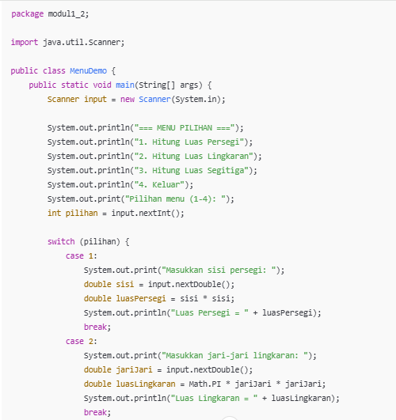
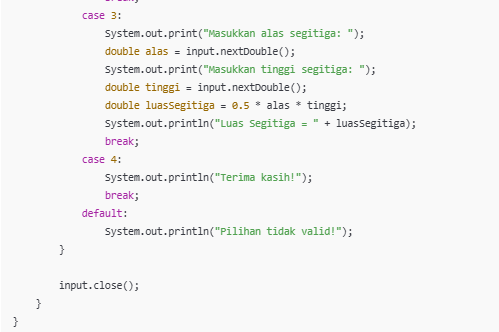

---

#### Screenshoot Hasil
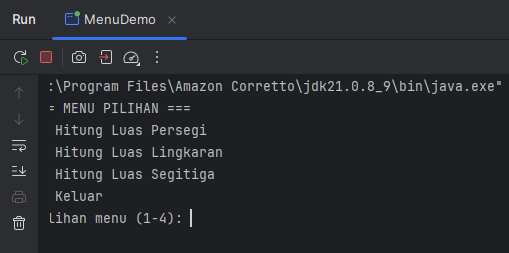

---

#### Analisa dan Pembahasan
Program MenuDemo menampilkan menu pilihan kepada pengguna untuk menghitung luas bangun datar atau keluar dari program. Logika program dibangun dengan struktur switch-case, di mana setiap pilihan menu mewakili operasi yang berbeda.
* Kasus 1: Menghitung luas persegi berdasarkan input sisi.
* Kasus 2: Menghitung luas lingkaran dengan memanfaatkan konstanta Math.PI.
* Kasus 3: Menghitung luas segitiga menggunakan rumus ½ × alas × tinggi.
* Kasus 4: Menghentikan program dengan menampilkan pesan "Terima kasih!".

Default: Menampilkan pesan "Pilihan tidak valid!" bila pengguna salah memasukkan menu.

Kesimpulan Analisis  
Program berhasil menggunakan switch-case untuk menangani pilihan menu dengan efektif.  
Setiap input dari pengguna menghasilkan output yang sesuai dengan rumus perhitungan bangun datar.  
Program ini dapat dijadikan contoh penerapan percabangan bercabang banyak di Java.  
Dengan menambahkan validasi input, program dapat lebih sempurna dan ramah terhadap kesalahan pengguna.  
---

Langkah 3: Program Nasted If (MenuDemo.java)
1. Buat file NestedIfDemo.java .
2. Ketik kode berikut untuk menentukan katergori usia:
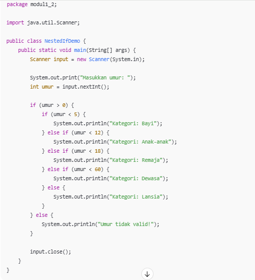

---

#### Screenshoot Hasil
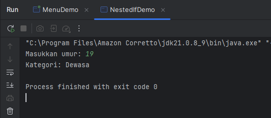

---

#### Analisa dan Pembahasan
Program NestedIfDemo menggunakan struktur kendali nested if (if bersarang) untuk menentukan kategori umur berdasarkan input dari pengguna.

Input Data
* Pengguna diminta memasukkan umur melalui keyboard.
* Input dibaca menggunakan Scanner.
* Struktur Kondisi Utama
* Pertama diperiksa apakah umur lebih dari 0 (if (umur > 0)).
* Jika umur tidak valid (≤ 0), program langsung menampilkan pesan "Umur tidak valid!".

Nested If (If Bersarang)
* Jika umur valid, maka dilakukan pengecekan lebih lanjut:
* umur < 5 → Kategori Bayi
* umur < 12 → Kategori Anak-anak
* umur < 18 → Kategori Remaja
* umur < 60 → Kategori Dewasa
* umur ≥ 60 → Kategori Lansia

---
Output Data

Program menampilkan kategori sesuai dengan rentang umur yang dimasukkan pengguna.

---

### Praktikum 4 - Struktur Control: Perulangan
#### Dasar Teori
Dalam pemrograman, perulangan (looping) adalah salah satu konsep dasar yang sangat penting. Loop digunakan untuk menjalankan serangkaian instruksi secara berulang tanpa harus menuliskan kode yang sama berulang-ulang. Dengan perulangan, program bisa lebih ringkas, efisien, dan mudah dipelihara.

Ada beberapa jenis perulangan utama di Java:

1. For Loop  
Digunakan ketika jumlah iterasi sudah diketahui.  
Biasanya dipakai untuk menghitung dari angka awal ke angka tertentu.

Sintaks umum:
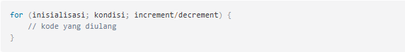
Contoh kasus: menampilkan angka 1 sampai 10, menampilkan bilangan genap, atau tabel perkalian.

2. While Loop  
Dipakai ketika jumlah perulangan tidak diketahui secara pasti.  
Kondisi dicek di awal sebelum isi loop dijalankan.  
Jika kondisi bernilai benar, maka perintah di dalam loop akan dijalankan.

Sintaks umum:
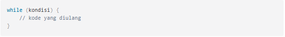
Cocok digunakan pada program interaktif, misalnya permainan tebak angka.

3. Do-While Loop
Hampir sama dengan while loop, tetapi perbedaan utamanya adalah perintah di dalam loop pasti dijalankan sekali lebih dulu, baru setelah itu kondisi diperiksa.     

Sintaks umum:  
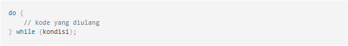
Cocok dipakai untuk menu interaktif, yang minimal harus tampil sekali.  

4. Nested Loop (Perulangan Bersarang)
Merupakan perulangan di dalam perulangan.  
Biasanya dipakai untuk membuat pola 2 dimensi, tabel, atau matriks.  
Contoh nyata: tabel perkalian, segitiga bintang, atau pola angka.  
Konsep perulangan ini menjadi pondasi penting sebelum masuk ke tahap yang lebih kompleks seperti pemrograman berorientasi objek, karena banyak logika yang membutuhkan eksekusi berulang.

---

#### Langkah praktikum
Langkah 1: Perulangan For
1. Buat file dengan nama (ForLoopDemo.java)
2. Ketik Kode Berikut:
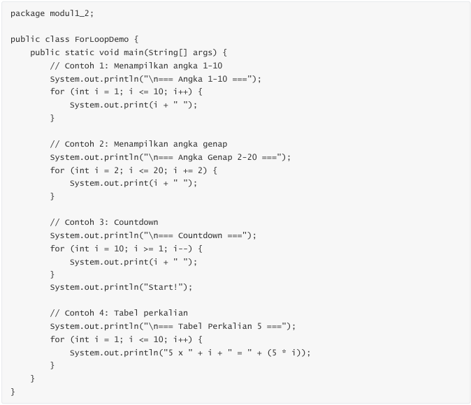

--- 

#### Screenshoot Hasil
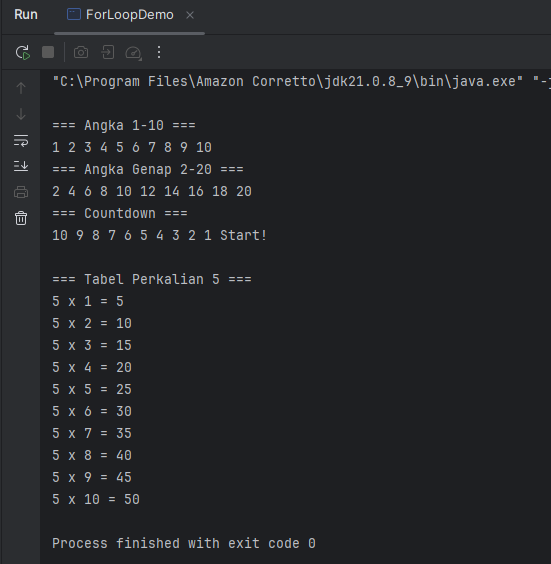

---

#### Analisa dan Pembahasan
1. Contoh 1 – Menampilkan angka 1–10

for (int i = 1; i <= 10; i++) {
System.out.print(i + " ");
}  
int i = 1 → inisialisasi nilai awal.  
i <= 10 → kondisi, selama nilai i masih ≤ 10, perulangan akan terus berjalan.  
i++ → increment, nilai i bertambah 1 setiap loop selesai.  
Program mencetak angka mulai dari 1 sampai 10 secara berurutan.
---
2. Contoh 2 – Menampilkan angka genap 2–20

for (int i = 2; i <= 20; i += 2) {
System.out.print(i + " ");
}  
Mulai dari angka 2.  
Kondisi berhenti jika i > 20.  
i += 2 artinya setiap loop, i bertambah 2.  
Jadi hanya angka genap yang keluar: 2, 4, 6, ... 20.
---
3. Contoh 3 – Countdown

for (int i = 10; i >= 1; i--) {
System.out.print(i + " ");
}  
System.out.println("Start!");  
Inisialisasi dari 10.  
Kondisi berhenti jika i < 1.  
i-- decrement, tiap loop nilai i berkurang 1.  
Hasilnya angka dari 10 sampai 1, lalu teks "Start!".
---
4. Contoh 4 – Tabel perkalian 5

for (int i = 1; i <= 10; i++) {
System.out.println("5 x " + i + " = " + (5 * i));
}
Loop dari 1 sampai 10.  
Di setiap iterasi, program hitung 5 * i.  
Hasilnya ditampilkan dalam format tabel perkalian (contoh: 5 x 3 = 15).
---
Program pertama berisi contoh penggunaan for untuk beberapa variasi:
* Contoh 1 (Angka 1–10) → perulangan menampilkan angka secara berurutan. Increment naik +1 setiap kali. Ini memperlihatkan bentuk perulangan paling dasar.
* Contoh 2 (Bilangan Genap 2–20) → logika perulangan tidak selalu increment 1, tetapi bisa dinaikkan sesuai kebutuhan. Di sini increment +2 untuk mendapatkan angka genap.
* Contoh 3 (Countdown) → perulangan juga bisa dibuat mundur dengan decrement. Cocok dipakai untuk kondisi penghitung mundur, misalnya timer.
* Contoh 4 (Tabel perkalian 5) → penerapan nyata perulangan dalam operasi matematika. Dengan loop, perhitungan perkalian bisa dibuat otomatis tanpa harus menuliskan satu per satu.  

Hasil analisa: for lebih fleksibel dibanding hanya menulis println, karena bisa mengatur jumlah langkah, arah perulangan, serta bentuk hasil yang diinginkan.

---

#### Langkah Praktikum
Langkah 2: Perulangan While dan Do-while
1. Buat file dengan nama (WhileLoopDemo.java)
2. Ketik Kode Berikut:
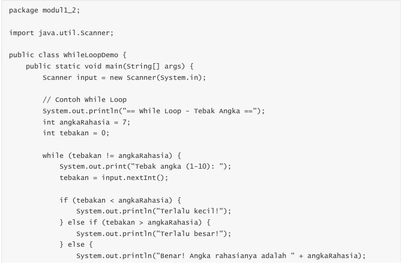
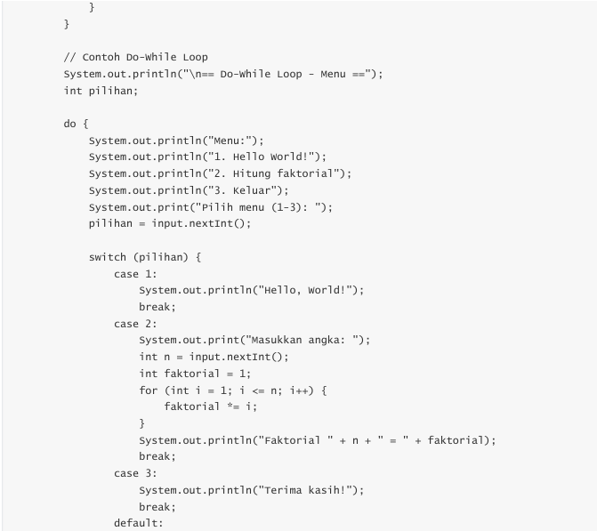
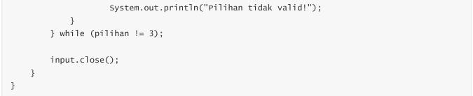

---

#### Screenshoot Hasil 
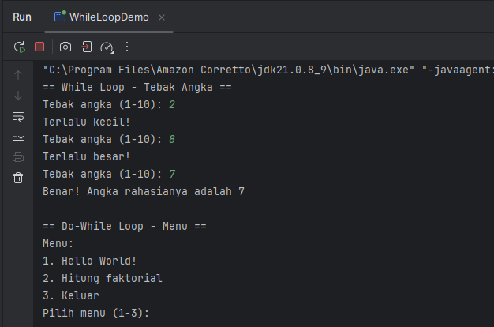

---

#### Analisa dan Pembahasan
Program kedua mendemonstrasikan perbedaan while dan do-while.

While loop (Tebak angka) → program akan terus meminta input sampai pengguna berhasil menebak angka rahasia. Karena kondisi diperiksa di awal, jika tebakan langsung benar, loop hanya berjalan sekali.

Do-while loop (Menu interaktif) → menu akan selalu muncul setidaknya sekali. Di dalamnya juga ditambahkan kombinasi switch-case dan for (untuk menghitung faktorial).

---
Analisa lebih lanjut:

* while cocok untuk kasus yang sifatnya menunggu kondisi benar, seperti validasi input atau game tebak-tebakan.
* do-while lebih nyaman untuk menu atau interaksi yang harus selalu muncul minimal sekali.
* Kelemahan program ini: angka rahasia statis (selalu 7) dan input tidak divalidasi. Jika pengguna memasukkan huruf, program akan error. Kalau mau lebih kuat, bisa ditambah Random untuk angka rahasia dan try-catch untuk validasi input.
---
1. While Loop – Tebak Angka

import java.util.Scanner;

public class TebakAngka {
public static void main(String[] args) {
Scanner input = new Scanner(System.in);

        int angkaRahasia = 7;
        int tebakan = 0;

        while (tebakan != angkaRahasia) {
            System.out.print("Tebak angka (1-10): ");
            tebakan = input.nextInt();

            if (tebakan < angkaRahasia) {
                System.out.println("Terlalu kecil!");
            } else if (tebakan > angkaRahasia) {
                System.out.println("Terlalu besar!");
            } else {
                System.out.println("Benar! Angka rahasianya adalah " + angkaRahasia);
            }
        }
    }
}

Angka rahasia ditentukan = 7.
* Variabel tebakan diisi 0 supaya loop langsung jalan.
* Kondisi while (tebakan != angkaRahasia) → selama tebakan salah, program akan terus minta input.
* Jika tebakan < 7 → tampil pesan "Terlalu kecil".
* Jika tebakan > 7 → tampil pesan "Terlalu besar".
* Jika tepat = 7 → tampil pesan benar, lalu loop berhenti.

---

#### Langkah Praktikum
Langkah 3: Perulangan Nested Loop
1. Buat file dengan nama (NestedLoopDemo.java)
2. Ketik Kode Berikut:
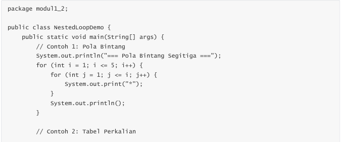
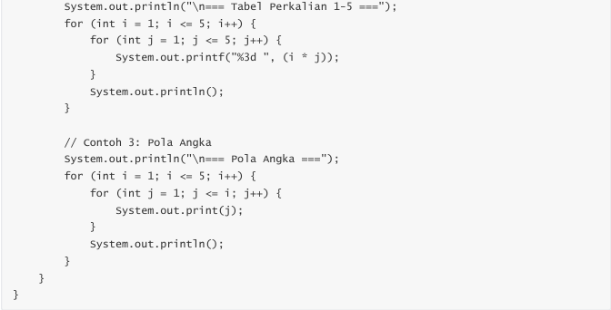

---

####  Screenshoot Hasil
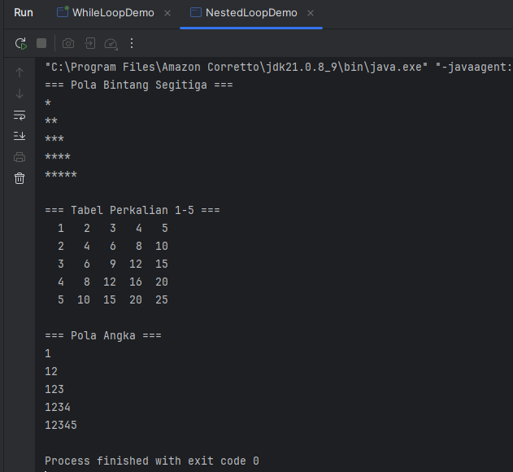

---

#### Analisa dan Pembahasan
1. Pola segitiga bintang

        for (int i = 1; i <= 5; i++) {  
        for (int j = 1; j <= i; j++) {  
        System.out.print("*");
        }  
        System.out.println();
        }

Loop luar (i) mengatur jumlah baris.  
Loop dalam (j) mengatur jumlah bintang di setiap baris.  
Hasil: baris pertama 1 bintang, baris kedua 2 bintang, dst.

---

2. Tabel perkalian 1–5

        for (int i = 1; i <= 5; i++) {  
        for (int j = 1; j <= 5; j++) {  
        System.out.printf("%3d ", (i * j)); 
        }  
        System.out.println();
        }

Loop luar → baris (1 sampai 5).  
Loop dalam → kolom (1 sampai 5).  
Setiap kali hitung i * j, hasil ditampilkan dengan printf supaya rata kanan.  
Output berupa tabel 5x5 yang rapi.

---

3. Pola angka segitiga

        for (int i = 1; i <= 5; i++) {  
        for (int j = 1; j <= i; j++) {  
        System.out.print(j);
        }  
        System.out.println();
        }

Mirip pola bintang, tapi yang dicetak adalah nilai j.  
Jadi baris pertama angka 1, baris kedua 12, baris ketiga 123, dst.

---

## 3. Kesimpulan
Pertama, penggunaan for loop sangat efektif ketika jumlah iterasi sudah jelas. Dari contoh percobaan, terlihat bahwa for bisa dipakai untuk mencetak angka urut, bilangan genap, countdown, maupun tabel perkalian. Hal ini membuktikan bahwa for adalah pilihan yang sederhana namun kuat untuk mengelola data dengan pola yang terprediksi.

Kedua, while dan do-while memperlihatkan perbedaan mendasar dalam alurnya. Pada game tebak angka, while loop akan terus mengulang hingga syarat benar terpenuhi. Sedangkan pada menu interaktif, do-while menjamin pengguna melihat menu setidaknya sekali, baru kemudian kondisi berhenti diperiksa. Perbedaan alur ini memberi fleksibilitas tinggi untuk kebutuhan program yang berbeda.

Ketiga, nested loop membuka peluang yang lebih kompleks. Dengan menumpuk loop, programmer bisa membuat pola visual, tabel, dan perhitungan multidimensi. Praktikum menunjukkan bagaimana nested loop dipakai untuk mencetak segitiga bintang, tabel perkalian, hingga pola angka. Ini membuktikan bahwa kombinasi perulangan bisa menghasilkan keluaran yang lebih bervariasi dan bermanfaat.

Secara keseluruhan, percobaan ini membuktikan bahwa penguasaan konsep loop di Java adalah fondasi penting. Dengan memahami kapan harus menggunakan for, while, do-while, maupun nested loop, seorang programmer dapat membuat program lebih efisien, jelas, dan serbaguna.

---

## 4. Referensi
Savitch, W. J. (2018). Java: An Introduction to Problem Solving and Programming. Pearson.  

Schildt, H. (2021). Java: The Complete Reference. McGraw-Hill.  

TutorialsPoint. (2023). Java Loops. https://www.tutorialspoint.com/java/java_loops.htm   

W3Schools. (2023). Java For, While, and Do While Loops. https://www.w3schools.com/java/java_loop.asp

---
