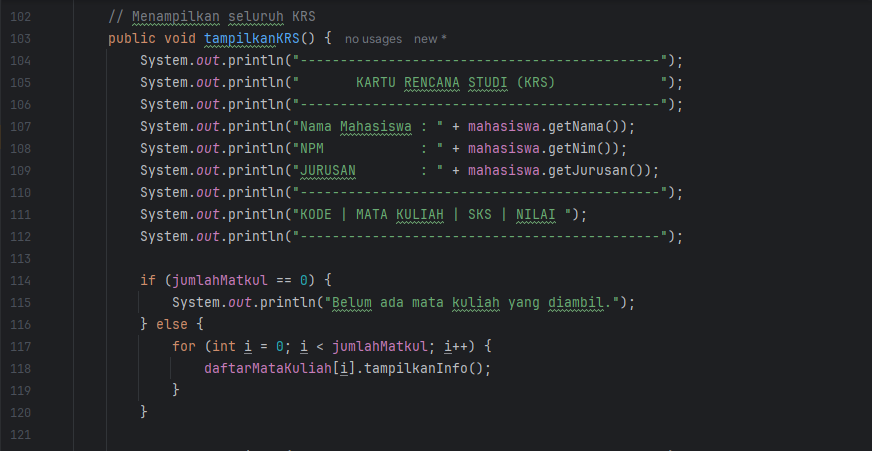

# Laporan Modul 4: Pengenalan Object Oriented Progamming
**Mata Kuliah:** Praktikum Pemrograman Berorientasi Objek   
**Nama:** SYAKILA ATHAYA AUFA  
**NIM:** 2024573010053  
**Kelas:** TI 2E  
**Tanggal Praktikum:** 08 October 2025

---

## 1. Abstrak
OOP (Object-Oriented Programming) adalah paradigma pemrograman yang memodelkan permasalahan dunia nyata ke dalam bentuk objek yang memiliki atribut dan perilaku. Melalui penggunaan **kelas** sebagai cetak biru dan penerapan empat pilar utamanya :  **enkapsulasi** (menyembunyikan detail internal), **abstraksi** (menyederhanakan kompleksitas), **pewarisan** (memungkinkan reuse kode), dan **polimorfisme** (memberi fleksibilitas bentuk perilaku) : OOP membantu menciptakan kode yang lebih terstruktur, efisien, mudah dikembangkan, serta mudah dirawat.

Secara mendasar, OOP bukan hanya sekadar cara menulis kode, tetapi juga cara berpikir dalam merancang sistem yang modular dan terorganisir. Dengan memisahkan setiap fungsi ke dalam objek-objek yang saling berinteraksi, pengembang dapat membangun program yang lebih mudah diuji, diperbarui, dan diperluas tanpa mengubah keseluruhan sistem. Pendekatan ini menjadikan OOP sebagai fondasi penting dalam pengembangan perangkat lunak modern.

---

## 2. Praktikum

### Praktikum 1: Dasar Class dan Object
Buat class
#### Dasar Teori
Class Mahasiswa digunakan untuk merepresentasikan data mahasiswa secara terstruktur.
Konsep yang dipakai di sini adalah Encapsulation, yaitu menyembunyikan atribut dengan private agar tidak bisa diakses langsung dari luar class.
Akses ke data dilakukan lewat getter method untuk menjaga keamanan dan konsistensi data.
Selain itu, class ini juga menggunakan constructor agar saat objek dibuat, semua data mahasiswa langsung terisi.
---
#### Langkah Praktikum
1. Buat file baru dengan nama Mahasiswa.java
2. Ketik kode berikut:

---
#### Pembahasan 
* Tiga atribut utama (nama, nim, jurusan) dibuat private agar hanya bisa diakses lewat method. Ini adalah prinsip dasar Encapsulation.
* Constructor Mahasiswa() digunakan untuk memberi nilai awal ke atribut saat objek baru dibuat. Misal:
* Mahasiswa mhs = new Mahasiswa("Syakila", "2024573010053", "Informatika", 3.8);
* Maka objek mhs otomatis menyimpan data nama, nim, dan jurusan.
* Tiga getter method (getNama(), getNim(), getJurusan()) berfungsi mengembalikan nilai dari masing-masing atribut saat dibutuhkan di class lain.
* Parameter ipk memang ditulis di constructor, tapi belum digunakan. Kemungkinan nanti akan dipakai untuk pengembangan fitur berikutnya.

---

### Praktikum 2:
Buat class MataKuliah
#### Dasar Teori
Class Matakuliah digunakan untuk menyimpan informasi setiap mata kuliah yang diambil mahasiswa.
Konsep yang dipakai adalah Encapsulation dan Object-Oriented Abstraction.
Setiap objek matakuliah punya atribut sendiri seperti kode, nama, jumlah SKS, dan nilai.
Class ini juga memuat logika untuk validasi nilai, konversi nilai angka ke huruf, serta konversi huruf ke bobot IPK.

---
#### Langkah Praktikum
1. Buat file baru dengan nama MataKuliah.java
2. Ketik kode berikut:

---
#### Pembahasan 
* Atribut kode, nama, sks, dan nilai diset private agar tidak bisa diakses langsung dari luar class.
* Constructor dipakai untuk inisialisasi data setiap mata kuliah. Contoh:
* Matakuliah mk = new Matakuliah("IF101", "Pemrograman Dasar", 3);
* Method setNilai() punya validasi agar nilai hanya antara 0–100. Kalau lebih, muncul pesan error.
* getNilaiHuruf() melakukan konversi nilai numerik menjadi huruf seperti sistem nilai kampus pada umumnya (A, B, C, D, E).
* getBobotNilai() mengonversi nilai huruf ke bobot IPK (A=4.0, B=3.0, dst).
* tampilkanInfo() menampilkan data lengkap setiap mata kuliah dengan format rapi di konsol.  
* Class ini penting karena nanti dipakai di RencanaKartuStudi.java untuk menghitung total SKS dan nilai IPK.

---

### Praktikum 3:
Buat class RencanaKartuStudi
#### Dasar Teori
Class KartuRencanaStudi berfungsi untuk mengatur daftar mata kuliah yang diambil mahasiswa dalam satu semester.
Class ini memakai komposisi objek, yaitu menggabungkan objek Mahasiswa dan array Matakuliah ke dalam satu class.
Fungsinya meliputi:
* Menambah mata kuliah ke daftar KRS
* Menghitung total SKS dan IPK
* Menampilkan daftar KRS secara lengkap
* Mencari mata kuliah berdasarkan kode

Class ini mengimplementasikan pengolahan array, looping, dan logika kontrol (if-else) untuk memastikan data yang dimasukkan valid.

---
#### Langkah Praktikum

1. Buat file baru dengan nama RencanaKartuStudi.java
2. Ketik kode berikut:

---
#### Pembahasan 
Atribut utama:

* mahasiswa menyimpan data mahasiswa.
* daftarMatakuliah berupa array untuk menampung daftar mata kuliah.
* jumlahMatkul menghitung jumlah mata kuliah yang sudah ditambahkan.
* maxMatkul sebagai batas maksimal jumlah mata kuliah.
* tambahMatakuliah() menambahkan objek Matakuliah ke array selama belum mencapai batas maksimal.
* hitungTotalSKS() menjumlahkan seluruh SKS dari mata kuliah yang diambil.
* hitungIPK() menghitung nilai IPK berdasarkan total bobot nilai dibagi total SKS.
* tampilkanKRS() menampilkan daftar lengkap mata kuliah beserta SKS dan nilai.
* cariMatakuliah() memudahkan pencarian mata kuliah berdasarkan kode (case-insensitive).

Class ini adalah inti logika program karena semua interaksi data mahasiswa dan mata kuliah diproses di sini.

---

### Praktikum 4:
Buat class main
#### Dasar Teori
File Main.java berfungsi sebagai class utama yang menjadi titik awal eksekusi program dalam konsep Object-Oriented Programming (OOP). Di dalamnya terdapat method public static void main(String[] args) yang mengatur alur jalannya sistem.

Program ini menggunakan objek dari class lain seperti Mahasiswa, Matakuliah, dan KartuRencanaStudi untuk menjalankan fitur seperti menambah, menampilkan, menghapus, dan memberi nilai pada mata kuliah. Selain itu, digunakan struktur kontrol seperti while dan switch-case untuk membuat menu interaktif.

Secara teori, Main.java berfungsi sebagai pengendali utama yang menghubungkan seluruh objek agar program berjalan secara terstruktur, modular, dan sesuai prinsip OOP.

---
#### Langkah Praktikum
1. Buat file baru dengan nama Main.java
2. Ketik kode berikut:

---
#### Screenshot Hasil
* sistem KRS

* menu 1, yaitu tambah mata kuliah

* gagal input mata kuliah

* menu 2, input nilai kuliah

* menu 3, tampilkan KRS

* menu 4, menghapus mata kuliah 

* menu 5, tampilkan nilai terbaik dan terburuk

* menu 6, yaitu keluar.

---
#### Pembahasan 
Kode pada file Main.java berfungsi sebagai pengendali utama dari seluruh sistem Kartu Rencana Studi (KRS). Di dalamnya, program menggunakan Scanner untuk menerima input dari pengguna, seperti data mahasiswa dan informasi mata kuliah.

Program ini menampilkan menu interaktif dengan beberapa fitur utama, seperti:

* Menambah mata kuliah ke dalam daftar KRS.
* Menginput nilai untuk setiap mata kuliah yang telah diambil.
* Menampilkan daftar KRS lengkap dengan total SKS dan IPK.
* Menghapus mata kuliah yang tidak diinginkan.
* Menampilkan nilai terbaik dan terburuk dari seluruh mata kuliah.

Struktur kontrol seperti while dan switch-case digunakan untuk mengatur pilihan menu secara berulang hingga pengguna memilih keluar. Setiap fitur dijalankan dengan memanggil method dari class lain (KartuRencanaStudi, Mahasiswa, dan MataKuliah), yang menunjukkan penerapan nyata konsep OOP — di mana setiap objek memiliki peran dan bekerja sama membentuk sistem yang modular dan efisien.

---

## Kesimpulan 
Dari seluruh rangkaian praktikum dan pembuatan program pada Modul 4 ini, dapat disimpulkan bahwa pemrograman berorientasi objek (Object-Oriented Programming / OOP) memberikan cara berpikir dan pendekatan yang lebih terstruktur dalam membangun aplikasi. Melalui penerapan empat pilar utama OOP : enkapsulasi, abstraksi, pewarisan, dan polimorfisme : program menjadi lebih mudah dipahami, dikembangkan, serta dipelihara.

Penerapan konsep OOP dalam empat file (Mahasiswa.java, MataKuliah.java, KartuRencanaStudi.java, dan Main.java) menunjukkan bagaimana setiap class memiliki tanggung jawab dan fungsi yang spesifik: Mahasiswa menyimpan data pribadi, MataKuliah mengelola informasi dan nilai mata kuliah, KartuRencanaStudi mengatur daftar dan perhitungan KRS, sedangkan Main menjadi pengendali utama yang menghubungkan seluruh komponen.

Secara keseluruhan, hasil implementasi ini membuktikan bahwa OOP tidak hanya mempermudah pembuatan sistem yang kompleks, tetapi juga meningkatkan efisiensi, keteraturan, dan fleksibilitas program dalam menghadapi perubahan atau pengembangan di masa mendatang.

---
## Referensi
Deitel, P. J., & Deitel, H. M. (2017). Java: How to Program (10th Edition). Pearson Education.

Oracle. (2025). Java Documentation – Object-Oriented Programming Concepts. Diakses dari https://docs.oracle.com/javase/tutorial/java/concepts/

Wahana Komputer. (2021). Pemrograman Berorientasi Objek dengan Java. Yogyakarta: Andi Offset.

Sunyoto, D. (2020). Dasar-Dasar Pemrograman Berorientasi Objek (OOP). Jakarta: Elex Media Komputindo.

TutorialsPoint. (2025). Java Object Oriented Programming (OOP) Concepts. Diakses dari https://www.tutorialspoint.com/java/java_object_classes.htm

---