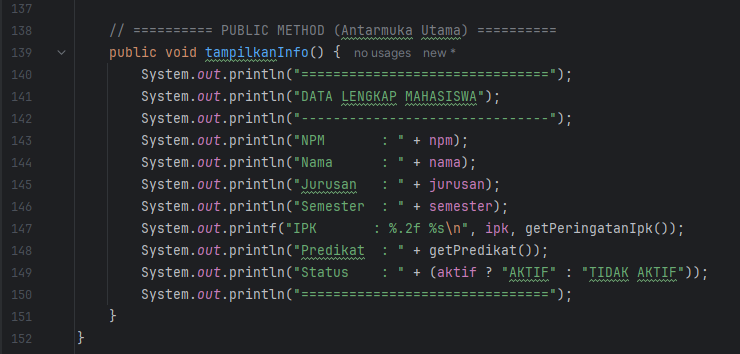
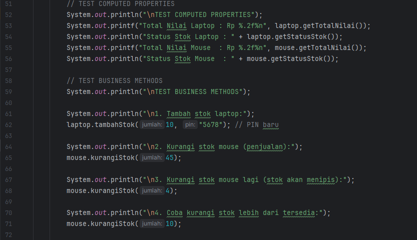

# Laporan Modul 5: Enkapsulasi
**Mata Kuliah:** Praktikum Pemrograman Berorientasi Objek   
**Nama:** SYAKILA ATHAYA AUFA  
**NIM:** 2024573010053  
**Kelas:** TI 2E

---

## 1. Abstrak
Enkapsulasi dalam Pemrograman Berorientasi Objek (OOP) adalah konsep fundamental yang mengikat data (atribut) dan metode (fungsi) yang beroperasi pada data tersebut menjadi satu unit, yang disebut objek.  
Secara harfiah, enkapsulasi berarti "pembungkusan". Dalam OOP, ini sering digambarkan sebagai menyembunyikan detail implementasi atau melindungi data dari akses atau modifikasi yang tidak diinginkan dari luar objek.  

Tujuan Encapsulation
* Data Protection - Melindungi data dari akses dan modifikasi yang tidak sah.
* Data Validation - Memastikan data yang masuk valid sebelum disimpan.
* Flexibility - Mudah mengubah implementasi internal tanpa mempengaruhi kode luar.
* Maintainability - Kode lebih mudah dipelihara dan di-debug.
* Modularity - Membuat kode lebih modular dan terorganisir

---

## 2. Praktikum
### Praktikum 1: Memahami Access Modifier
#### dasar teori
Access modifier dalam Java digunakan untuk mengatur tingkat akses terhadap atribut dan method dalam class. Tujuannya agar data lebih aman dan hanya bisa diakses sesuai kebutuhan (konsep enkapsulasi).

Terdapat empat jenis access modifier, yaitu:
* private: hanya bisa diakses dalam class yang sama.
* default: bisa diakses dalam package yang sama.
* protected: bisa diakses dalam package yang sama dan oleh subclass.
* public: bisa diakses dari mana saja.

Dengan penggunaan access modifier yang tepat, program menjadi lebih terstruktur, aman, dan mudah dikelola.

---
#### langkah-langkah
1. Program Person

2. Program AccessModifierTest

#### hasil output
Menampilkan hasil akses atribut & method dari class Person.
* tidak di comment

* setelah di comment (uncomment)

---
#### Pembahasan
Dari percobaan menggunakan dua class (Person dan AccessModifierTest), dapat disimpulkan bahwa access modifier berfungsi untuk mengatur tingkat akses terhadap atribut dan method dalam suatu class.  
Ketika program dijalankan dalam keadaan baris kode yang mengakses atribut atau method private masih di-comment, program dapat berjalan normal dan menampilkan seluruh informasi melalui method public yang tersedia.  
Namun, setelah baris kode tersebut di-uncomment (misalnya mencoba mengakses person.nama, person.umur, atau person.metodePribadi()), program akan menampilkan error. Hal ini terjadi karena atribut dan method dengan modifier private tidak dapat diakses langsung dari luar class-nya, melainkan hanya bisa digunakan di dalam class Person itu sendiri.

Dengan demikian, dapat disimpulkan bahwa:
* private digunakan untuk menyembunyikan data agar tidak bisa diakses sembarangan.
* Akses terhadap atribut private hanya dapat dilakukan melalui method public, seperti tampilkanInfo() atau panggilMetodePribadi().

Percobaan ini membuktikan konsep enkapsulasi dalam OOP, yaitu melindungi data dengan membatasi akses langsung dari luar class.

---

### Praktikum 2: Getter dan Setter
#### dasar teori
Getter dan Setter adalah metode akses dalam konsep Encapsulation (enkapsulasi) pada pemrograman berorientasi objek (OOP).

Getter digunakan untuk mengambil (membaca) nilai dari atribut yang bersifat private.

Setter digunakan untuk mengubah (menulis) nilai atribut tersebut secara terkendali dengan validasi agar data tetap aman dan konsisten.

Tujuan utama penggunaannya:
* Melindungi data (atribut) dari akses langsung dari luar kelas.
* Memberi kontrol penuh terhadap bagaimana data diubah atau ditampilkan.
* Menjaga integritas data melalui validasi (misalnya, IPK harus 0.0–4.0).

Dengan kata lain, getter dan setter membantu menciptakan interface publik yang aman untuk berinteraksi dengan data internal objek.

---
#### langkah-langkah
1. Program Mahasiswa

2. Program Getter Setter 

3. Problem 

hapus bagian: System.out.println("Predikat: " + mhs.getPredikat());

---  
#### hasil output
Menunjukkan hasil kerja getter/setter & validasi data.

---
#### Pembahasan
Program GetterSetterTest dan Mahasiswa menunjukkan bagaimana enkapsulasi bekerja secara nyata:

Semua atribut mahasiswa (npm, nama, jurusan, ipk, semester, aktif) dibuat private, sehingga tidak bisa diakses langsung dari luar kelas.

Akses terhadap atribut dilakukan melalui getter dan setter yang memiliki validasi (misalnya nama tidak boleh kosong, IPK harus antara 0–4).

Ketika dijalankan, program menampilkan data awal, kemudian melakukan berbagai pengujian setter (baik yang valid maupun tidak valid).

Hasilnya menunjukkan bahwa:
* Data hanya berubah jika input valid.
* Jika tidak valid, muncul pesan error dan data tidak berubah.
* Program juga mendemonstrasikan bahwa mencoba mengakses atribut secara langsung (tanpa getter/setter) akan menyebabkan error, karena pelanggaran prinsip enkapsulasi.

Dengan demikian, program ini berhasil memperlihatkan fungsi dan manfaat getter–setter untuk menjaga keamanan data serta memastikan perubahan nilai dilakukan secara benar dan terkontrol.

Pada awalnya, terjadi error karena method getPredikat() bersifat private namun dipanggil langsung di luar class (GetterSetterTest).
Hal ini melanggar prinsip enkapsulasi, karena method private tidak boleh diakses dari luar.
Solusinya adalah menghapus baris mhs.getPredikat() dari class test dan memastikan pemanggilan getPredikat() hanya dilakukan dari dalam class Mahasiswa, yaitu melalui method tampilkanInfo().

Dengan perbaikan tersebut, program berhasil dijalankan tanpa error dan seluruh data mahasiswa ditampilkan dengan validasi yang benar.
Selain itu, hasil output menunjukkan bahwa setiap setter melakukan pengecekan terhadap data yang dimasukkan, sementara getter hanya menampilkan data yang valid dan sudah tersimpan.
---

### Praktikum 3: Read-Only dan Write-Only Properties
#### dasar teori
Dalam pemrograman berorientasi objek (OOP), encapsulation (enkapsulasi) adalah konsep yang digunakan untuk menyembunyikan detail internal dari suatu objek dan hanya menampilkan bagian yang diperlukan kepada pengguna. Hal ini dilakukan dengan menggunakan access modifier seperti private, public, dan protected, serta melalui getter dan setter untuk mengatur akses terhadap atribut.

Konsep ini menghasilkan beberapa jenis properti:
* Read-only property → hanya memiliki getter, digunakan untuk membaca data tetapi tidak bisa diubah.
* Write-only property → hanya memiliki setter, digunakan untuk mengatur nilai tetapi tidak bisa dibaca langsung.
* Computed property → tidak disimpan sebagai atribut, melainkan dihitung secara langsung (on-the-fly) setiap kali dipanggil.
* Read-write property → memiliki getter dan setter, sehingga bisa dibaca dan diubah dengan aturan tertentu (misalnya validasi PIN).

Melalui enkapsulasi, data menjadi lebih aman, terkendali, dan terhindar dari perubahan yang tidak sah.

---
#### langkah-langkah
1. Program Product

2. Program ProductTest

#### hasil output

Menampilkan semua hasil pengujian read-only, write-only, computed, & validasi PIN.
#### Pembahasan
Pada program ini terdapat dua class utama, yaitu Product dan ProductTest.
Class Product berfungsi sebagai representasi dari suatu produk yang memiliki atribut seperti nama, harga, stok, dan adminPin, sedangkan ProductTest digunakan untuk menguji berbagai jenis properti yang ada.

1. Read-only Properties  
Atribut seperti:

        private final String productId;
        private final LocalDateTime createdAt;

hanya memiliki getter, sehingga tidak bisa diubah setelah dibuat.
Contoh hasil:

    Product ID (read-only): PRD-1001
    Created At (read-only): 22-10-2025 21:15:45
    ✓ Properti ini TIDAK BISA diubah setelah dibuat

Artinya: data ini bersifat tetap (immutable) agar identitas produk dan waktu pembuatan tidak dapat dimanipulasi.

2. Write-only Properties  

Atribut adminPin hanya memiliki setter melalui method:

    public void changeAdminPin(String oldPin, String newPin)

Properti ini tidak bisa dibaca secara langsung (tidak ada getter), hanya dapat diubah jika PIN lama valid.
Contoh hasil:

    PIN tidak bisa dibaca (tidak ada getter)
    Hanya bisa diubah dengan validasi PIN lama:
    ✓ PIN berhasil diubah!
    ✗ PIN lama salah!

Artinya: data PIN dijaga kerahasiaannya agar tidak bisa diakses sembarangan dari luar kelas.

3. Computed Properties

Method berikut tidak memiliki atribut tersimpan, tetapi dihitung setiap kali dipanggil:

    public double getTotalNilai() { return harga * stok; }
    public String getStatusStok() { ... }

Outputnya selalu menyesuaikan kondisi terbaru:

Total Nilai Laptop : Rp 180000000.00
Status Stok Laptop : TERSEDIA  

Artinya: nilai dihitung secara real-time berdasarkan perubahan harga atau stok.

4. Validasi PIN

Setiap kali ada perubahan data penting seperti harga, nama, stok, atau PIN, program memerlukan validasi PIN agar perubahan hanya bisa dilakukan oleh pihak berwenang.
Contoh hasil:

    ✗ PIN salah! Gagal mengubah harga.
    ✓ Harga berhasil diubah menjadi Rp 9000000.00
Artinya: hanya PIN yang benar yang dapat mengubah data, fitur ini menjaga keamanan data produk.

5. Kesimpulan
Berdasarkan hasil pengujian program:
* Read-only properties → tidak bisa diubah setelah objek dibuat.
* Write-only properties → tidak bisa dibaca secara langsung.
* Computed properties → dihitung otomatis setiap kali dipanggil.
* Semua perubahan data memerlukan validasi PIN untuk menjaga keamanan.

Dengan demikian, program ini berhasil mendemonstrasikan prinsip enkapsulasi dan keamanan data melalui penggunaan getter, setter, dan validasi PIN.

---

## 3. Kesimpulan
Dari seluruh rangkaian praktikum yang telah dilakukan mulai dari Access Modifier, Getter dan Setter (Enkapsulasi), hingga Read-only, Write-only, dan Computed Properties dengan Validasi PIN, dapat disimpulkan bahwa konsep enkapsulasi dalam pemrograman berorientasi objek (OOP) memiliki peran penting dalam menjaga keamanan dan integritas data suatu objek.

Beberapa poin utama yang dapat disimpulkan adalah:

Access Modifier (private, protected, default, dan public) digunakan untuk mengatur sejauh mana atribut atau method dapat diakses dari luar kelas, sehingga mencegah penyalahgunaan data.

Getter dan Setter berfungsi sebagai jembatan antara data private dengan dunia luar. Getter hanya membaca data, sedangkan Setter bertugas mengubah data dengan validasi tertentu agar nilai yang disimpan tetap benar.

Read-only dan Write-only Properties memperkuat prinsip keamanan data — Read-only mencegah perubahan data penting, sedangkan Write-only melindungi informasi sensitif seperti PIN.

Computed Properties menunjukkan bagaimana data dapat dihitung secara otomatis (on-the-fly) tanpa disimpan langsung, sehingga hasil selalu sesuai dengan kondisi terbaru objek.

Validasi PIN dan pembatasan akses menjadi bentuk nyata penerapan enkapsulasi untuk melindungi proses pengubahan data agar hanya bisa dilakukan oleh pihak yang berwenang.

Secara keseluruhan, dari ketiga praktikum ini dapat disimpulkan bahwa enkapsulasi adalah fondasi utama dalam membangun sistem yang aman, terstruktur, dan efisien.
Melalui penerapan access modifier, getter, setter, dan validasi logika, program dapat berjalan lebih terkendali, aman dari kesalahan, serta mudah dipelihara dan dikembangkan di masa depan.

---